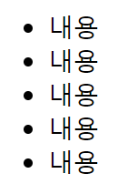
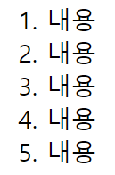
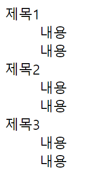

# HTML ( Hyper Text Markup Language )
웹하면서 자주 쓰이는 거 위주로 넣었다.  
HTML은 웹페이지를 위한 <b>마크업 언어</b>이다. 

  

시맨틱 태그

## header
로고와 nav태그가 포함한다.
## nav
페이지 이동 메뉴를 포함한다.
## aside
우리가 싫어하는 광고내용 포함
## section 
주제별 콘텐츠 영역을 나눈다.
### artice 
콘텐츠 내용이 들어간다
## footer
회사소개, copyright, 약관 등 내용이 포함된다.

  

자주 쓰는 태그

# 그룹

## div

## ul, ol
ol 은 옆에 숫자가 적힘
> ### li

## dl 
> ### dt 
> ### dd 

# 텍스트

## h1 ~ h6
제목을 나타낼 때 쓰임
## a 
페이지 이동이 필요할 때 쓰임 
## p 
문단으로 나눌때 쓰임
## pre
문단인데 여러 줄 일 때 쓰임
## span
가로로 텍스트를 쓰고 싶을때 쓰임
## strong 
텍스트 강조효과로 쓰임

# 테이블

## table
> ### caption
테이블에 제목을 입력 

> ### thead
>> #### tr 
>>> ##### th 

> ### tbody
>> #### tr 
>>> ##### td

# 폼 
## form 
form태그에는 action, method 속성이 들어가야한다.        
form태그 안에 들어가는 input, textarea, select 태크에는 name 속성이 들어가야한다.

> input 

input 태그에는 type이라는 속성이 들어간다.      
type 속성은 종류는 알아서 검색

> textarea

> button

> select
>> option 

  

자주 쓰는 속성

## id 
중복은 불가능하다.

## class 
중복 가능.

## target 
a 태그에서 쓰인다.

## title 
a, img, input, icon, 긴 내용이 있는 태그에 쓰인다.

